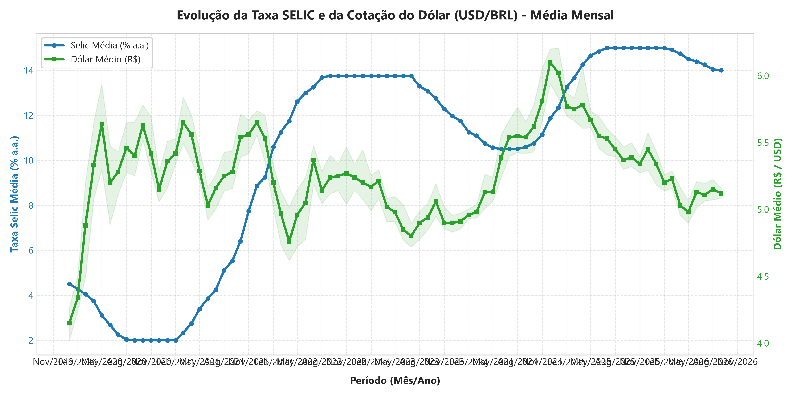
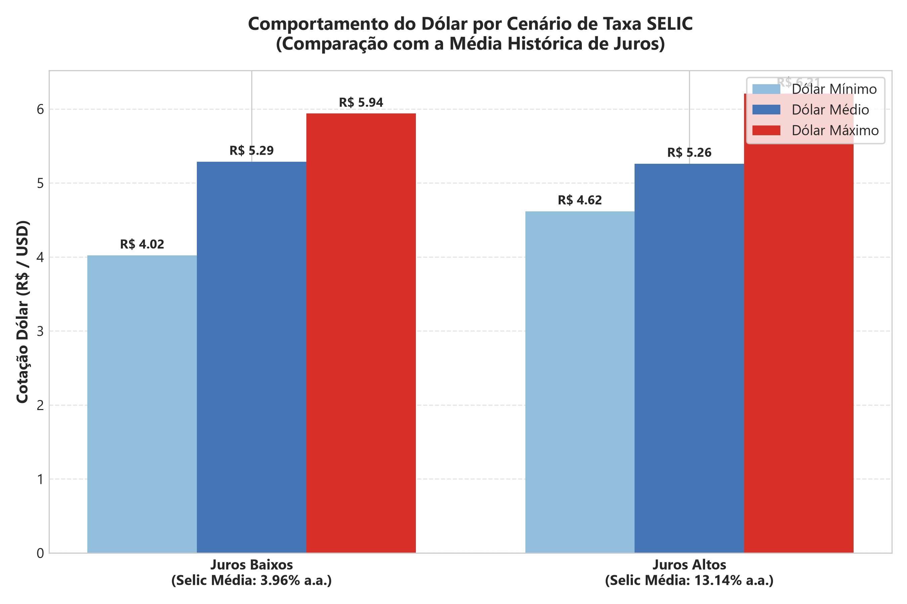
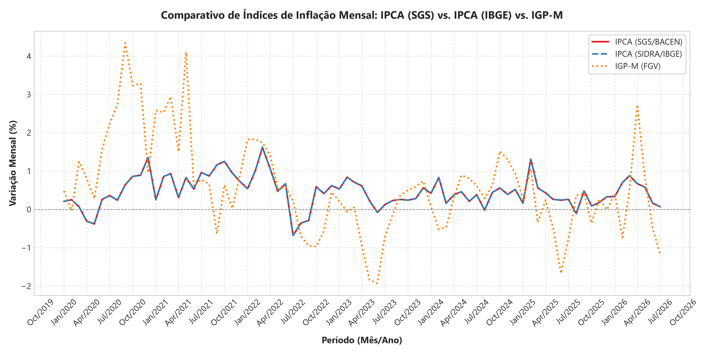
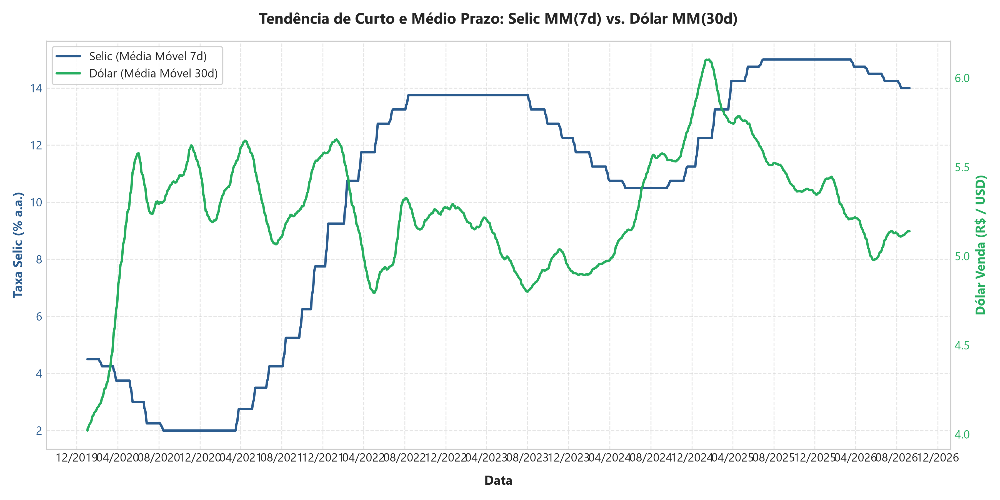
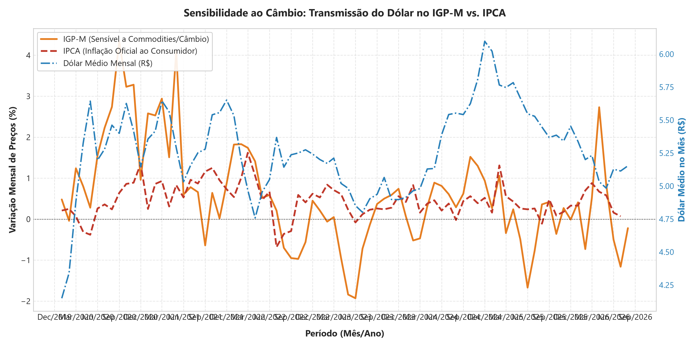

# Análise de Indicadores Econômicos Brasileiros (Selic, Câmbio, IPCA e IGP-M)

## 📌 Contexto

A relação entre taxa de juros (Selic), câmbio (USD/BRL) e inflação (IPCA e IGP-M) é o pilar central da política macroeconômica brasileira. Compreender como os ciclos de juros impactam a moeda estrangeira e como os índices de preços reagem às flutuações cambiais permite extrair insights estratégicos para o mercado financeiro e tomada de decisão econômica.

## ❓ Perguntas de negócio

Este projeto busca responder:

1. Como o dólar (USD/BRL) variou de acordo com a taxa Selic ao longo do tempo?
2. Qual o comportamento do dólar em cenários de juros altos versus juros baixos?
3. Há convergência entre o IPCA coletado pelo BACEN (SGS) e o IPCA oficial do IBGE (SIDRA)?
4. Qual a tendência de curto e médio prazo da Selic e do Câmbio através de Médias Móveis?
5. O IGP-M reage de forma mais sensível ao câmbio do que o IPCA?

## 🗂️ Fonte de dados

- **Origem:** API SGS (Sistema Gerenciador de Séries Temporais) do Banco Central do Brasil & API SIDRA / IBGE.
- **Séries utilizadas:**

| Indicador | Origem | Código / Tabela |
|---|---|---|
| Selic | BACEN SGS | 432 |
| Câmbio USD/BRL | BACEN SGS | 1 |
| IPCA | BACEN SGS | 433 |
| IGP-M | BACEN SGS | 189 |
| IPCA (Variação Mensal) | IBGE SIDRA | Tabela 1737 (Var 63) |

- **Período analisado:** Janeiro de 2020 até o período recente (2026).

## 🛠️ Metodologia

O fluxo de dados segue a arquitetura:
1. **ETL (Python):** Coleta automatizada via APIs `python-bcb` e `sidrapy`.
2. **Armazenamento:** Banco de Dados relacional SQLite (`banco_indicadores.db`).
3. **Análise SQL:** Consultas avançadas utilizando agregações mensais, funções de janela (`OVER / ROWS BETWEEN`) e classificação condicional (`CASE WHEN`).
4. **Visualização Estatística:** Exportação de gráficos em alta resolução (PNG 300 DPI) utilizando `Matplotlib` e `Seaborn`.

## 🔍 Principais análises

### 1. Selic x Câmbio (Média Mensal)

A query `01_selic_cambio_mensal.sql` consolida as médias mensais da taxa Selic e da cotação do Dólar venda, juntamente com a amplitude da variação cambial no mês.



---

### 2. Ciclos de Juros Altos x Comportamento do Câmbio

A query `02_periodo_alta_juros_cambio.sql` classifica cada dia do histórico em "Juros Altos" ou "Juros Baixos" com base na média histórica da Selic, analisando a cotação média, máxima e mínima do Dólar nesses dois ambientes.



---

### 3. IPCA (SGS) vs. IPCA (IBGE) vs. IGP-M

A query `03_ipca_selic_defasagem.sql` realiza o cruzamento entre o IPCA retornado pelo Sistema do BACEN, o IPCA oficial do IBGE e o IGP-M da FGV.



---

### 4. Médias Móveis para Suavização de Tendência (Selic 7d e Dólar 30d)

A query `04_juros_real_media_movel.sql` aplica Window Functions (`AVG OVER`) para calcular a média móvel de 7 dias da Selic e de 30 dias do Dólar, reduzindo o ruído diário das operações.



---

### 5. Transmissão Cambial: IGP-M vs. IPCA

A query `05_igpm_cambio_vs_ipca_cambio.sql` avalia a sensibilidade comparativa do IGP-M (fortemente influenciado por atacado e commodities dolarizadas) frente ao IPCA diante das variações da moeda americana.



---

## 🧰 Tecnologias utilizadas

- **Linguagens:** Python, SQL (SQLite)
- **Bibliotecas Python:** `pandas`, `matplotlib`, `seaborn`, `python-bcb`, `sidrapy`
- **Banco de Dados:** SQLite (`banco_indicadores.db`)

## 📁 Estrutura do repositório

```
├── README.md
├── banco_indicadores.db
├── main.py
├── executar_analises.py
├── /sql
│   ├── 00_criacao_do_banco.sql
│   ├── 01_selic_cambio_mensal.sql
│   ├── 02_periodo_alta_juros_cambio.sql
│   ├── 03_ipca_selic_defasagem.sql
│   ├── 04_juros_real_media_movel.sql
│   └── 05_igpm_cambio_vs_ipca_cambio.sql
├── /scripts
│   ├── coleta_dados_bacen.py
│   ├── database.py
│   └── gerar_graficos.py
└── /images
    ├── 01_selic_cambio_mensal.png
    ├── 02_periodo_alta_juros_cambio.png
    ├── 03_ipca_selic_defasagem.png
    ├── 04_juros_real_media_movel.png
    └── 05_igpm_cambio_vs_ipca_cambio.png
```

## 👤 Autor

Projeto de Análise de Indicadores Macroeconômicos.